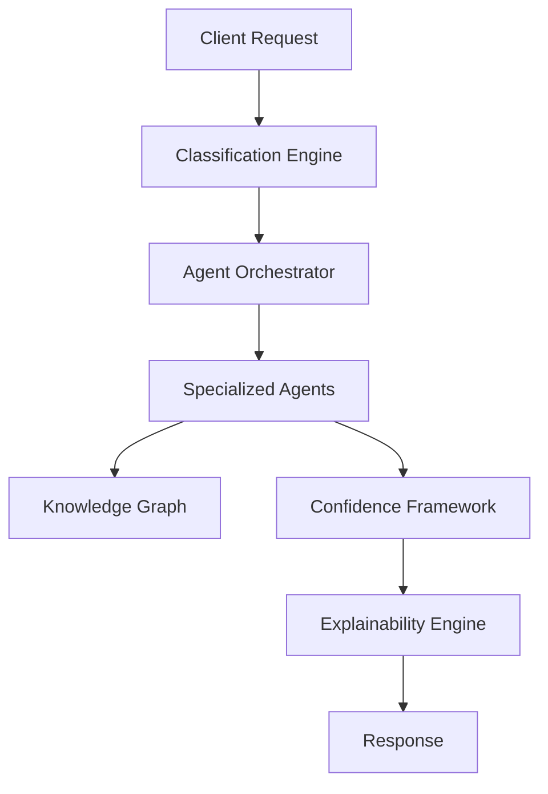

# SFDR Navigator Agent - Phase 2A Implementation Guide

## Table of Contents

1. [Architecture Overview](#architecture-overview)
2. [Core Components](#core-components)
3. [Agent Development](#agent-development)
4. [Confidence Framework](#confidence-framework)
5. [Explainability Engine](#explainability-engine)
6. [Knowledge Graph](#knowledge-graph)
7. [Orchestration Patterns](#orchestration-patterns)
8. [Testing Strategies](#testing-strategies)
9. [Performance Optimization](#performance-optimization)
10. [Deployment Guide](#deployment-guide)

## Architecture Overview

### Design Principles

The Phase 2A architecture follows the "AI as Runtime" paradigm, where AI agents are the primary execution units rather than traditional rule-based systems.

#### Key Architectural Patterns

1. **Agent-Based Architecture**: Specialized AI agents handle specific tasks
2. **Event-Driven Communication**: Agents communicate through structured events
3. **Confidence-Driven Routing**: Decisions routed based on AI confidence levels
4. **Layered Explainability**: Multiple explanation levels for different audiences
5. **Knowledge Graph Integration**: Structured regulatory knowledge representation

#### System Boundaries



### Technology Stack

- **Runtime**: Node.js 18+ with TypeScript 5.0+
- **Testing**: Jest with comprehensive coverage
- **Build**: TypeScript compiler with strict mode
- **Validation**: JSON Schema validation
- **Documentation**: TSDoc for API documentation

## Core Components

### 1. Agent System (`src/ai/agents/`)

#### Agent Interface Design

```typescript
interface BaseAgent {
  id: string;
  name: string;
  version: string;
  capabilities: AgentCapability;
  
  // Core methods
  initialize(config: AgentConfig): Promise<void>;
  process(input: AgentInput): Promise<AgentOutput>;
  validate(input: AgentInput): ValidationResult;
  getHealth(): HealthStatus;
}
```

#### Agent Lifecycle

1. **Initialization**: Load configuration and dependencies
2. **Validation**: Verify input data quality and completeness
3. **Processing**: Execute core agent logic
4. **Output Generation**: Format results with confidence scores
5. **Cleanup**: Release resources and log metrics

#### Agent Communication Protocol

```typescript
interface AgentMessage {
  id: string;
  timestamp: Date;
  source: string;
  target: string;
  type: MessageType;
  payload: unknown;
  metadata: MessageMetadata;
}

type MessageType = 
  | 'REQUEST'           // Request processing
  | 'RESPONSE'          // Processing result
  | 'COLLABORATION'     // Inter-agent collaboration
  | 'FEEDBACK'          // Learning feedback
  | 'ERROR'             // Error notification
  | 'HEALTH_CHECK';     // Health status check
```

### 2. Confidence Framework (`src/ai/confidence/`)

#### Confidence Calculation Algorithm

```typescript
class ConfidenceCalculator {
  calculateOverallConfidence(
    factors: ConfidenceFactors,
    context: ClassificationContext
  ): number {
    const weights = this.getFactorWeights(context);
    
    return (
      factors.dataCompleteness * weights.dataCompleteness +
      factors.regulatoryClarity * weights.regulatoryClarity +
      factors.modelCertainty * weights.modelCertainty +
      factors.historicalAccuracy * weights.historicalAccuracy +
      factors.consensusLevel * weights.consensusLevel
    );
  }
}
```

#### Decision Routing Logic

```typescript
class DecisionRouter {
  determineDecisionType(
    confidence: number,
    riskLevel: RiskLevel,
    context: ClassificationContext
  ): DecisionType {
    // High confidence + low risk = automated
    if (confidence >= 0.9 && riskLevel === 'LOW') {
      return 'AUTOMATED';
    }
    
    // Medium confidence = human review
    if (confidence >= 0.7) {
      return 'HUMAN_REVIEW';
    }
    
    // Low confidence or high risk = expert consultation
    if (confidence >= 0.5 || riskLevel === 'HIGH') {
      return 'EXPERT_CONSULTATION';
    }
    
    // Very low confidence = escalation
    return 'ESCALATION';
  }
}
```

### 3. Explainability Engine (`src/ai/explainability/`)

#### Explanation Generation Pipeline

```typescript
class ExplanationPipeline {
  async generateExplanation(
    classification: SFDRClassification,
    confidence: ConfidenceAssessment,
    context: ClassificationContext
  ): Promise<ComprehensiveExplanation> {
    
    // 1. Generate classification rationale
    const rationale = await this.generateClassificationRationale(
      classification, context
    );
    
    // 2. Analyze data influence
    const dataAnalysis = await this.analyzeDataInfluence(
      context.inputData, classification
    );
    
    // 3. Map regulatory requirements
    const regulatoryMapping = await this.mapRegulatoryRequirements(
      classification, context.regulations
    );
    
    // 4. Assess confidence factors
    const confidenceAssessment = await this.assessConfidenceFactors(
      confidence, context
    );
    
    // 5. Generate technical insights
    const technicalInsights = await this.generateTechnicalInsights(
      classification, context.modelOutputs
    );
    
    return {
      classificationRationale: rationale,
      dataAnalysis,
      regulatoryMapping,
      confidenceAssessment,
      technicalInsights,
      auditTrail: this.generateAuditTrail(context)
    };
  }
}
```

#### Explanation Templates

```typescript
const EXPLANATION_TEMPLATES = {
  ARTICLE_6: {
    primaryReason: "Fund does not promote environmental or social characteristics",
    evidencePatterns: [
      "ESG integration level: {level}",
      "Sustainability objectives: {objectives}",
      "PAI consideration: {paiStatus}"
    ]
  },
  
  ARTICLE_8: {
    primaryReason: "Fund promotes environmental and/or social characteristics",
    evidencePatterns: [
      "Environmental characteristics: {envCharacteristics}",
      "Social characteristics: {socialCharacteristics}",
      "Sustainable investment percentage: {percentage}%"
    ]
  },
  
  ARTICLE_9: {
    primaryReason: "Fund has sustainable investment as its objective",
    evidencePatterns: [
      "Sustainable investment percentage: {percentage}%",
      "Taxonomy alignment: {taxonomyAlignment}%",
      "DNSH assessment: {dnshStatus}"
    ]
  }
};
```

### 4. Knowledge Graph (`src/ai/knowledge/`)

#### Graph Structure Design

```typescript
interface KnowledgeNode {
  id: string;
  type: NodeType;
  properties: Record<string, unknown>;
  relationships: Relationship[];
  metadata: NodeMetadata;
}

interface Relationship {
  id: string;
  type: RelationshipType;
  source: string;
  target: string;
  properties: Record<string, unknown>;
  weight: number;
}

type NodeType = 
  | 'REGULATION'        // SFDR articles
  | 'INTERPRETATION'    // ESMA guidance
  | 'CASE'             // Compliance cases
  | 'INDICATOR'        // PAI indicators
  | 'TAXONOMY'         // EU Taxonomy elements
  | 'CONCEPT';         // Regulatory concepts
```

#### Knowledge Query Engine

```typescript
class KnowledgeQueryEngine {
  async findRelevantRegulations(
    classification: SFDRArticleClassification,
    context: ClassificationContext
  ): Promise<RegulatoryKnowledge[]> {
    
    const query = this.buildRegulationQuery(classification, context);
    const nodes = await this.graph.query(query);
    
    return nodes.map(node => this.mapToRegulatoryKnowledge(node));
  }
  
  async findSimilarCases(
    fundProfile: FundProfile,
    similarity: number = 0.8
  ): Promise<ComplianceCase[]> {
    
    const embedding = await this.generateFundEmbedding(fundProfile);
    const similarCases = await this.graph.findSimilar(
      embedding, 
      'CASE', 
      similarity
    );
    
    return similarCases.map(node => this.mapToComplianceCase(node));
  }
}
```

### 5. Orchestration Engine (`src/ai/orchestration/`)

#### Workflow Definition

```typescript
interface WorkflowDefinition {
  id: string;
  name: string;
  description: string;
  steps: WorkflowStep[];
  conditions: WorkflowCondition[];
  errorHandling: ErrorHandlingStrategy;
}

interface WorkflowStep {
  id: string;
  name: string;
  agentType: string;
  input: StepInput;
  output: StepOutput;
  dependencies: string[];
  timeout: number;
  retryPolicy: RetryPolicy;
}
```

#### Workflow Execution Engine

```typescript
class WorkflowExecutor {
  async executeWorkflow(
    definition: WorkflowDefinition,
    context: ExecutionContext
  ): Promise<WorkflowResult> {
    
    const execution = new WorkflowExecution(definition, context);
    
    try {
      // 1. Validate workflow definition
      await this.validateWorkflow(definition);
      
      // 2. Initialize agents
      await this.initializeAgents(definition.steps);
      
      // 3. Execute steps in dependency order
      const results = await this.executeSteps(definition.steps, context);
      
      // 4. Aggregate results
      const finalResult = await this.aggregateResults(results);
      
      return {
        status: 'SUCCESS',
        result: finalResult,
        execution: execution.getMetrics()
      };
      
    } catch (error) {
      return this.handleWorkflowError(error, execution);
    }
  }
}
```

## Agent Development

### Creating a New Agent

#### 1. Define Agent Interface

```typescript
// src/ai/agents/document-intelligence-agent.ts
export interface DocumentIntelligenceAgent extends BaseAgent {
  extractText(document: Document): Promise<ExtractedText>;
  identifyStructure(text: string): Promise<DocumentStructure>;
  extractEntities(text: string): Promise<NamedEntity[]>;
  classifyDocument(document: Document): Promise<DocumentClassification>;
}
```

#### 2. Implement Agent Logic

```typescript
export class DocumentIntelligenceAgentImpl implements DocumentIntelligenceAgent {
  constructor(
    private config: DocumentIntelligenceConfig,
    private nlpService: NLPService,
    private logger: Logger
  ) {}
  
  async process(input: AgentInput): Promise<AgentOutput> {
    const startTime = Date.now();
    
    try {
      // Validate input
      const validation = this.validate(input);
      if (!validation.isValid) {
        throw new AgentError('Invalid input', validation.errors);
      }
      
      // Extract document content
      const document = input.data as Document;
      const extractedText = await this.extractText(document);
      
      // Identify document structure
      const structure = await this.identifyStructure(extractedText.content);
      
      // Extract named entities
      const entities = await this.extractEntities(extractedText.content);
      
      // Classify document type
      const classification = await this.classifyDocument(document);
      
      // Calculate confidence
      const confidence = this.calculateConfidence({
        textQuality: extractedText.quality,
        structureClarity: structure.clarity,
        entityCount: entities.length,
        classificationCertainty: classification.certainty
      });
      
      return {
        agentId: this.id,
        timestamp: new Date(),
        processingTime: Date.now() - startTime,
        confidence,
        data: {
          extractedText,
          structure,
          entities,
          classification
        },
        metadata: {
          version: this.version,
          model: this.config.model,
          parameters: this.config.parameters
        }
      };
      
    } catch (error) {
      this.logger.error('Document intelligence processing failed', error);
      throw new AgentError('Processing failed', { originalError: error });
    }
  }
}
```

#### 3. Register Agent

```typescript
// src/ai/agents/registry.ts
export class AgentRegistry {
  private agents = new Map<string, AgentFactory>();
  
  register<T extends BaseAgent>(
    type: string,
    factory: AgentFactory<T>
  ): void {
    this.agents.set(type, factory);
  }
  
  create<T extends BaseAgent>(
    type: string,
    config: AgentConfig
  ): T {
    const factory = this.agents.get(type);
    if (!factory) {
      throw new Error(`Unknown agent type: ${type}`);
    }
    
    return factory.create(config) as T;
  }
}

// Register the new agent
registry.register('document-intelligence', {
  create: (config) => new DocumentIntelligenceAgentImpl(
    config as DocumentIntelligenceConfig,
    nlpService,
    logger
  )
});
```

### Agent Testing Patterns

#### Unit Testing

```typescript
// src/ai/agents/document-intelligence-agent.test.ts
describe('DocumentIntelligenceAgent', () => {
  let agent: DocumentIntelligenceAgent;
  let mockNLPService: jest.Mocked<NLPService>;
  
  beforeEach(() => {
    mockNLPService = createMockNLPService();
    agent = new DocumentIntelligenceAgentImpl(
      testConfig,
      mockNLPService,
      mockLogger
    );
  });
  
  describe('text extraction', () => {
    it('should extract text from PDF documents', async () => {
      const document = createTestPDF();
      const result = await agent.extractText(document);
      
      expect(result.content).toBeDefined();
      expect(result.quality).toBeGreaterThan(0.8);
    });
    
    it('should handle corrupted documents gracefully', async () => {
      const corruptedDocument = createCorruptedPDF();
      
      await expect(agent.extractText(corruptedDocument))
        .rejects.toThrow('Document extraction failed');
    });
  });
  
  describe('entity extraction', () => {
    it('should identify SFDR-related entities', async () => {
      const text = 'This fund promotes environmental characteristics under SFDR Article 8';
      const entities = await agent.extractEntities(text);
      
      expect(entities).toContainEqual(
        expect.objectContaining({
          type: 'REGULATION',
          value: 'SFDR Article 8',
          confidence: expect.any(Number)
        })
      );
    });
  });
});
```

#### Integration Testing

```typescript
// src/ai/agents/integration.test.ts
describe('Agent Integration', () => {
  let orchestrator: AgentOrchestrator;
  
  beforeEach(async () => {
    orchestrator = new AgentOrchestrator(testConfig);
    await orchestrator.initialize();
  });
  
  it('should coordinate document intelligence and classification agents', async () => {
    const request = createSampleClassificationRequest();
    const result = await orchestrator.executeWorkflow('standard', request);
    
    expect(result.status).toBe('SUCCESS');
    expect(result.agentResults).toHaveLength(2);
    expect(result.agentResults[0].agentId).toBe('document-intelligence');
    expect(result.agentResults[1].agentId).toBe('classification');
  });
});
```

## Testing Strategies

### Test Pyramid Structure

```
    🔺 E2E Tests (10%)
   🔺🔺 Integration Tests (20%)
  🔺🔺🔺 Unit Tests (70%)
```

### Unit Testing Guidelines

1. **Test Individual Components**: Each agent, framework, and engine component
2. **Mock External Dependencies**: Use Jest mocks for external services
3. **Test Edge Cases**: Invalid inputs, error conditions, boundary values
4. **Verify Confidence Scores**: Ensure confidence calculations are accurate
5. **Test Explanation Quality**: Verify explanations are comprehensive and accurate

### Integration Testing Patterns

```typescript
// Test agent collaboration
describe('Agent Collaboration', () => {
  it('should pass data between agents correctly', async () => {
    const documentAgent = createDocumentAgent();
    const classificationAgent = createClassificationAgent();
    
    const documentResult = await documentAgent.process(testInput);
    const classificationInput = {
      ...testInput,
      data: documentResult.data
    };
    
    const classificationResult = await classificationAgent.process(classificationInput);
    
    expect(classificationResult.confidence).toBeGreaterThan(0.7);
  });
});
```

### End-to-End Testing

```typescript
// Test complete workflows
describe('Complete Classification Workflow', () => {
  it('should classify Article 8 fund correctly', async () => {
    const engine = createTestEngine();
    const request = createArticle8Request();
    
    const response = await engine.classifyFund(request);
    
    expect(response.status).toBe('SUCCESS');
    expect(response.classification?.article).toBe('ARTICLE_8');
    expect(response.confidence?.score).toBeGreaterThan(0.8);
    expect(response.explanation).toBeDefined();
  });
});
```

## Performance Optimization

### Caching Strategies

```typescript
class CacheManager {
  private cache = new Map<string, CacheEntry>();
  
  async get<T>(
    key: string,
    factory: () => Promise<T>,
    ttl: number = 3600000 // 1 hour
  ): Promise<T> {
    const entry = this.cache.get(key);
    
    if (entry && Date.now() - entry.timestamp < ttl) {
      return entry.value as T;
    }
    
    const value = await factory();
    this.cache.set(key, {
      value,
      timestamp: Date.now()
    });
    
    return value;
  }
}
```

### Parallel Processing

```typescript
class ParallelProcessor {
  async processInParallel<T, R>(
    items: T[],
    processor: (item: T) => Promise<R>,
    concurrency: number = 5
  ): Promise<R[]> {
    const results: R[] = [];
    const chunks = this.chunkArray(items, concurrency);
    
    for (const chunk of chunks) {
      const chunkResults = await Promise.all(
        chunk.map(item => processor(item))
      );
      results.push(...chunkResults);
    }
    
    return results;
  }
}
```

### Memory Management

```typescript
class ResourceManager {
  private resources = new Set<Disposable>();
  
  register(resource: Disposable): void {
    this.resources.add(resource);
  }
  
  async cleanup(): Promise<void> {
    const cleanupPromises = Array.from(this.resources)
      .map(resource => resource.dispose());
    
    await Promise.all(cleanupPromises);
    this.resources.clear();
  }
}
```

## Deployment Guide

### Environment Configuration

```typescript
// config/environments.ts
export const environments = {
  development: {
    ai: {
      confidence: {
        thresholds: {
          automated: 0.8,
          humanReview: 0.6,
          expertConsultation: 0.4
        }
      },
      agents: {
        timeout: 30000,
        retries: 3
      },
      cache: {
        enabled: true,
        ttl: 300000 // 5 minutes
      }
    }
  },
  
  production: {
    ai: {
      confidence: {
        thresholds: {
          automated: 0.9,
          humanReview: 0.7,
          expertConsultation: 0.5
        }
      },
      agents: {
        timeout: 10000,
        retries: 2
      },
      cache: {
        enabled: true,
        ttl: 3600000 // 1 hour
      }
    }
  }
};
```

### Health Checks

```typescript
class HealthChecker {
  async checkSystemHealth(): Promise<HealthStatus> {
    const checks = await Promise.allSettled([
      this.checkAgentHealth(),
      this.checkKnowledgeGraphHealth(),
      this.checkConfidenceFrameworkHealth(),
      this.checkExplainabilityEngineHealth()
    ]);
    
    const components = this.processHealthChecks(checks);
    const overallStatus = this.determineOverallStatus(components);
    
    return {
      status: overallStatus,
      timestamp: new Date(),
      components,
      metrics: await this.collectMetrics()
    };
  }
}
```

### Monitoring and Observability

```typescript
class MetricsCollector {
  private metrics = new Map<string, Metric>();
  
  recordClassification(
    duration: number,
    confidence: number,
    success: boolean
  ): void {
    this.incrementCounter('classifications.total');
    this.recordHistogram('classifications.duration', duration);
    this.recordGauge('classifications.confidence', confidence);
    
    if (success) {
      this.incrementCounter('classifications.success');
    } else {
      this.incrementCounter('classifications.error');
    }
  }
  
  getMetrics(): Record<string, number> {
    const result: Record<string, number> = {};
    
    for (const [name, metric] of this.metrics) {
      result[name] = metric.getValue();
    }
    
    return result;
  }
}
```

## Best Practices

### Code Organization

1. **Separation of Concerns**: Each component has a single responsibility
2. **Dependency Injection**: Use constructor injection for dependencies
3. **Interface Segregation**: Define focused interfaces for each capability
4. **Error Handling**: Comprehensive error handling with proper logging
5. **Type Safety**: Strict TypeScript configuration with no `any` types

### Performance Guidelines

1. **Lazy Loading**: Load agents and resources only when needed
2. **Connection Pooling**: Reuse connections to external services
3. **Batch Processing**: Process multiple requests together when possible
4. **Caching**: Cache expensive computations and external API calls
5. **Resource Cleanup**: Properly dispose of resources to prevent memory leaks

### Security Considerations

1. **Input Validation**: Validate all inputs using JSON Schema
2. **Output Sanitization**: Sanitize outputs to prevent injection attacks
3. **Access Control**: Implement role-based access control
4. **Audit Logging**: Log all classification decisions for audit trails
5. **Data Encryption**: Encrypt sensitive data at rest and in transit

### Regulatory Compliance

1. **Explainability**: Ensure all decisions can be explained
2. **Auditability**: Maintain complete audit trails
3. **Data Retention**: Implement appropriate data retention policies
4. **Privacy**: Follow GDPR and other privacy regulations
5. **Accuracy**: Regularly validate and update classification models

---

**Implementation Status**: ✅ **Phase 2A Complete**

**Next Steps**: Begin Phase 2B development with enhanced ML models and real-time learning capabilities.